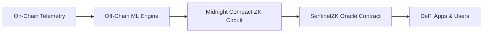
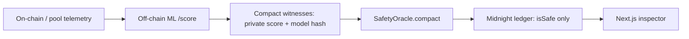

# 🛡️ SentinelZK

> **Privacy-Preserving Exploit & Rug-Pull Detection Oracle for DeFi on Midnight Network**

SentinelZK is an intelligent on-chain security oracle. It analyzes smart contracts and liquidity pools for exploit and rug-pull risks, generating **Zero-Knowledge (ZK) safety attestations** verified on the Midnight Network.

DeFi protocols, wallets, and users can verify whether a contract is safe before interacting with it, **without revealing the underlying machine learning model or proprietary detection rules** that attackers could exploit to evade detection.

---

## 💡 Why SentinelZK?

| Traditional Auditing & Analytics | SentinelZK Approach |
| :--- | :--- |
| ❌ **Vulnerable to Evasion:** Publishing raw risk logic teaches attackers how to bypass detection. | ✅ **Zero-Knowledge Privacy:** Proofs confirm safety without exposing proprietary features or thresholds. |
| ❌ **Centralized Trust:** Users must blindly trust off-chain risk APIs or static audit reports. | ✅ **Cryptographic Guarantees:** Model integrity is anchored on-chain with verifiable ZK proofs. |
| ❌ **Point-in-Time Only:** Static code audits don't protect against sudden liquidity drains or malicious admin key changes. | ✅ **Continuous Telemetry:** Ingests live pool dynamics, ownership churn, and liquidity velocity. |

---

## ⚙️ How It Works

SentinelZK operates across 4 streamlined stages:



1. **Telemetry Ingestion:** Monitored signals include liquidity removal velocity, top-holder concentration, admin ownership changes, and contract age.
2. **Off-Chain ML Scoring:** A trained risk model computes a score (0–100) based on historical exploit patterns and pool behaviors.
3. **ZK Proof Generation:** A Midnight Compact circuit generates a zero-knowledge proof verifying that:
   - The contract risk score meets the required safety threshold ($Score < Threshold$).
   - The score was generated by the verified, registered model weights (tamper-proof binding).
4. **On-Chain Oracle Attestation:** The binary verdict (`SAFE` / `SUSPICIOUS` / `EXPLOIT_DETECTED`) and cryptographic proof reference are published to the Midnight Network, queryable by any dApp.

---

## 🌟 Key Features

- **🔍 Live Contract Inspector:** Look up any contract or liquidity pool to immediately view its safety verdict, risk signals, and ZK proof metadata.
- **⚡ Zero-Knowledge Attestations:** Verifies safety while keeping the raw features and sensitive scoring mechanisms completely confidential.
- **🔗 Midnight Oracle Feed:** Transparent feed of recently verified attestations, block heights, and cryptographic proof hashes.
- **🛠️ Developer-First SDK:** Ready-to-use TypeScript hooks and Compact smart contract interfaces for seamless DeFi protocol integration.
- **🌌 Immersive Interface:** Clean, high-performance UI built with Next.js, Tailwind CSS, and WebGL visualizations.

---

## 🚀 Getting Started

### Prerequisites

- [Node.js](https://nodejs.org/) (v18.17.0 or higher recommended)
- [pnpm](https://pnpm.io/) (v9 or v10)

### Installation

1. **Clone the repository:**
   ```bash
   git clone https://github.com/your-username/sentinel-zk.git
   cd sentinel-zk
   ```

2. **Install dependencies:**
   ```bash
   pnpm install
   ```

3. **Start the development server:**
   ```bash
   pnpm dev
   ```

4. **Open your browser:**
   Navigate to [http://localhost:3000](http://localhost:3000) to explore SentinelZK.

### Building for Production

```bash
pnpm build
pnpm start
```

---

## 📁 Project Structure

```text
SentinelZK/
├── app/                  # Next.js App Router (Layout & Pages)
│   ├── globals.css       # Global design styles & custom utilities
│   ├── layout.tsx        # Root layout & metadata
│   └── page.tsx          # Main application dashboard
├── components/           # UI Components
│   ├── contract-inspector.tsx  # Contract lookup & risk telemetry viewer
│   ├── developer-tab.tsx       # Code samples & integration guides
│   ├── how-it-works.tsx        # Interactive 4-step architectural breakdown
│   ├── oracle-feed.tsx         # Live attestations & network metrics
│   ├── sentinel-hero.tsx       # Interactive WebGL hero section
│   └── ui/                     # Reusable design components
├── lib/                  # Business logic & utilities
│   ├── sentinel-service.ts     # Oracle feed & contract analyzer (ML + mocks)
│   ├── ml-attestation.ts       # Maps ML /score responses → attestations
│   ├── types.ts                # TypeScript definitions & schemas
│   └── utils.ts                # Helper utility functions
├── ml/                   # Off-chain GBDT risk model (Python)
│   ├── sentinel_ml/      # Feature schema, RiskModel, bootstrap telemetry
│   ├── server.py         # FastAPI /score + /health
│   ├── train.py          # Train from CSV (or synthetic bootstrap)
│   └── artifacts/        # Serialized risk_gbdt.joblib
└── PROJECT_ARCHITECTURE.md     # In-depth architectural & ZK circuit specs
```

### Optional: live ML scoring

```bash
cd ml
python -m venv .venv
.venv\Scripts\activate          # Windows
pip install -r requirements.txt
python train.py                 # bootstrap synthetic artifact
uvicorn server:app --host 127.0.0.1 --port 8000
```

Copy `.env.example` to `.env.local`. Defaults keep the **mock oracle** so the UI works without Lace or Preprod.

```env
NEXT_PUBLIC_USE_MOCK_ORACLE=true
```

---

## Midnight Integration

Midnight is used because Compact circuits prove statements about **private** witness data and only disclose what we write to the ledger.

**Why Midnight:** the safety check is `private_score < threshold` bound to a registered `model_hash`. Attackers see the boolean verdict, not the score or features.

**Private**

- ML risk score (`privateRiskScore` witness)
- feature vectors (never sent to Compact)
- wallet seed / mnemonic (server env only)

**Public**

- target id (SHA-256 of the lowercase address)
- `isSafe`
- registered model hash and threshold
- attestation timestamp

**How the Compact contract works:** `midnight/contracts/SafetyOracle.compact` (language 0.22, compactc 0.30.0) stores a `Map<Bytes<32>, PublicAttestation>`. `submitAttestation` is a real impure circuit with prover/verifier keys under `midnight/contracts/managed/safety-oracle/keys/`.

**How verification works:** midnight-js + a local proof server prove the circuit. Other clients read ledger state from the Preprod indexer. This is not a hash-as-proof shortcut.

### Wallet Setup

- Wallet: [Lace](https://www.lace.io/) with Midnight enabled
- Network: Preprod (`NEXT_PUBLIC_MIDNIGHT_NETWORK=preprod`)
- Proof server in Lace: `http://localhost:6300` (`npm run proof:up` in `midnight/`)
- Connect from the header button (`wallet.connect('preprod')` via `@midnight-ntwrk/dapp-connector-api` 4.0.1)
- Faucet: https://midnight-tmnight-preprod.nethermind.dev/

### Deployment

From WSL or Linux/macOS (not Windows `compact.exe`):

```bash
cd midnight
npm install
npm run compile
cp .env.example .env.preprod
# set MIDNIGHT_PREPROD_SEED and MIDNIGHT_EXPECTED_MODEL_HASH — never commit this file
npm run proof:up
npm run deploy
```

Copy the printed contract address into `MIDNIGHT_CONTRACT_ADDRESS` and `NEXT_PUBLIC_MIDNIGHT_CONTRACT_ADDRESS`.

### Local Development

```bash
# frontend (mock oracle, default)
pnpm install
pnpm dev

# Compact circuit tests
cd midnight
npm install
npm run compile
npm test
```

To point the UI at Midnight instead of mocks, `.env.local`:

```env
NEXT_PUBLIC_USE_MOCK_ORACLE=false
NEXT_PUBLIC_MIDNIGHT_NETWORK=preprod
NEXT_PUBLIC_MIDNIGHT_CONTRACT_ADDRESS=<deployed address>
MIDNIGHT_CONTRACT_ADDRESS=<deployed address>
```

Do not put seeds in `NEXT_PUBLIC_*`.

### Testing

```bash
cd midnight
npm test
```

Network deploy tests (optional, needs Docker + funded seed):

```bash
npm run test:local
npm run test:preprod
```

### Architecture



Details: [docs/MIDNIGHT_INTEGRATION.md](docs/MIDNIGHT_INTEGRATION.md) and [docs/ML_MIDNIGHT_INTERFACE.md](docs/ML_MIDNIGHT_INTERFACE.md).

---

## 📁 Project Structure

```text
SentinelZK/
├── app/                  # Next.js App Router
├── components/           # UI (inspector, wallet button, existing pages)
├── lib/
│   ├── sentinel-service.ts   # Mock / ML / Midnight switch
│   ├── midnight/             # Wallet + contract client
│   ├── ml-attestation.ts
│   └── types.ts
├── midnight/             # Compact contract, deploy, circuit tests
│   ├── contracts/SafetyOracle.compact
│   └── scripts/deploy.ts
├── ml/                   # Off-chain GBDT (owned by the ML teammate)
└── docs/
    ├── MIDNIGHT_INTEGRATION.md
    └── ML_MIDNIGHT_INTERFACE.md
```

Integrating SentinelZK checks into a dApp:

### Querying via TypeScript

```typescript
import { getSafetyAttestation } from '@/lib/midnight/client'

const attestation = await getSafetyAttestation('0x7a250d5630B4cF539739dF2C5dAcb4c659F2488D')

if (!attestation.isSafe) {
  throw new Error(`Transaction blocked: Risk detected (Proof: ${attestation.proof.proofRef})`)
}
```

---

## 🏆 Hackathon Context

SentinelZK is built for the **Akindo WaveHack, Midnight Network Track**:
- **Target:** Privacy-preserving security infrastructure for decentralized finance.
- **Technology:** Midnight Network ZK Smart Contracts (Compact), zero-knowledge threshold proofs, and off-chain machine learning security pipelines.

---

## 📄 License

This project is licensed under the [Apache-2.0 License](LICENSE).
