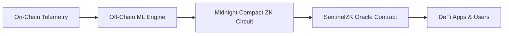

# 🛡️ SentinelZK

> **Privacy-Preserving Exploit & Rug-Pull Detection Oracle for DeFi on Midnight Network**

SentinelZK is an intelligent on-chain security oracle. It analyzes smart contracts and liquidity pools for exploit and rug-pull risks, generating **Zero-Knowledge (ZK) safety attestations** verified on the Midnight Network.

DeFi protocols, wallets, and users can verify whether a contract is safe before interacting with it, **without revealing the underlying machine learning model or proprietary detection rules** that attackers could exploit to evade detection.

---

## 💡 Why SentinelZK?

| Traditional Auditing & Analytics | SentinelZK Approach |
| :--- | :--- |
| ❌ **Vulnerable to Evasion:** Publishing raw risk logic teaches attackers how to bypass detection. | ✅ **Zero-Knowledge Privacy:** Proofs confirm safety without exposing proprietary features or thresholds. |
| ❌ **Centralized Trust:** Users must blindly trust off-chain risk APIs or static audit reports. | ✅ **Cryptographic Guarantees:** Model integrity is anchored on-chain with verifiable ZK proofs. |
| ❌ **Point-in-Time Only:** Static code audits don't protect against sudden liquidity drains or malicious admin key changes. | ✅ **Continuous Telemetry:** Ingests live pool dynamics, ownership churn, and liquidity velocity. |

---

## ⚙️ How It Works

SentinelZK operates across 4 streamlined stages:



1. **Telemetry Ingestion:** Monitored signals include liquidity removal velocity, top-holder concentration, admin ownership changes, and contract age.
2. **Off-Chain ML Scoring:** A trained risk model computes a score (0–100) based on historical exploit patterns and pool behaviors.
3. **ZK Proof Generation:** A Midnight Compact circuit generates a zero-knowledge proof verifying that:
   - The contract risk score meets the required safety threshold ($Score < Threshold$).
   - The score was generated by the verified, registered model weights (tamper-proof binding).
4. **On-Chain Oracle Attestation:** The binary verdict (`SAFE` / `SUSPICIOUS` / `EXPLOIT_DETECTED`) and cryptographic proof reference are published to the Midnight Network, queryable by any dApp.

---

## 🌟 Key Features

- **🔍 Live Contract Inspector:** Look up any contract or liquidity pool to immediately view its safety verdict, risk signals, and ZK proof metadata.
- **⚡ Zero-Knowledge Attestations:** Verifies safety while keeping the raw features and sensitive scoring mechanisms completely confidential.
- **🔗 Midnight Oracle Feed:** Transparent feed of recently verified attestations, block heights, and cryptographic proof hashes.
- **🛠️ Developer-First SDK:** Ready-to-use TypeScript hooks and Compact smart contract interfaces for seamless DeFi protocol integration.
- **🌌 Immersive Interface:** Clean, high-performance UI built with Next.js, Tailwind CSS, and WebGL visualizations.

---

## 🚀 Getting Started

### Prerequisites

- [Node.js](https://nodejs.org/) (v18.17.0 or higher recommended)
- [pnpm](https://pnpm.io/) (v9 or v10)

### Installation

1. **Clone the repository:**
   ```bash
   git clone https://github.com/your-username/sentinel-zk.git
   cd sentinel-zk
   ```

2. **Install dependencies:**
   ```bash
   pnpm install
   ```

3. **Start the development server:**
   ```bash
   pnpm dev
   ```

4. **Open your browser:**
   Navigate to [http://localhost:3000](http://localhost:3000) to explore SentinelZK.

### Building for Production

```bash
pnpm build
pnpm start
```

---

## 📁 Project Structure

```text
SentinelZK/
├── app/                  # Next.js App Router (Layout & Pages)
│   ├── globals.css       # Global design styles & custom utilities
│   ├── layout.tsx        # Root layout & metadata
│   └── page.tsx          # Main application dashboard
├── components/           # UI Components
│   ├── contract-inspector.tsx  # Contract lookup & risk telemetry viewer
│   ├── developer-tab.tsx       # Code samples & integration guides
│   ├── how-it-works.tsx        # Interactive 4-step architectural breakdown
│   ├── oracle-feed.tsx         # Live attestations & network metrics
│   ├── sentinel-hero.tsx       # Interactive WebGL hero section
│   └── ui/                     # Reusable design components
├── lib/                  # Business logic & utilities
│   ├── sentinel-service.ts     # Mock oracle feed & contract analyzer
│   ├── types.ts                # TypeScript definitions & schemas
│   └── utils.ts                # Helper utility functions
└── PROJECT_ARCHITECTURE.md     # In-depth architectural & ZK circuit specs
```

---

## 💻 Developer Integration

Integrating SentinelZK checks into your dApp takes only a few lines of code:

### Querying via TypeScript SDK

```typescript
import { SentinelOracleClient } from '@sentinelzk/sdk'

const sentinel = new SentinelOracleClient({
  network: 'midnight-preprod'
})

// Query safety attestation before allowing user deposit
const attestation = await sentinel.getSafetyAttestation('0x7a250d5630B4cF539739dF2C5dAcb4c659F2488D')

if (!attestation.isSafe) {
  throw new Error(`Transaction blocked: Risk detected (Proof: ${attestation.proofRef})`)
}

console.log('Contract verified safe by Midnight ZK Oracle!')
```

---

## 🏆 Hackathon Context

SentinelZK is built for the **Akindo WaveHack, Midnight Network Track**:
- **Target:** Privacy-preserving security infrastructure for decentralized finance.
- **Technology:** Midnight Network ZK Smart Contracts (Compact), zero-knowledge threshold proofs, and off-chain machine learning security pipelines.

---

## 📄 License

This project is licensed under the [Apache-2.0 License](LICENSE).
